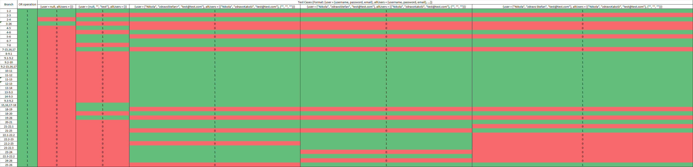

# SI_2023_lab2_216051

### Nikola Petrovski 216051

### Control Flow Graph

### Цикломатска комплексност

Цикломатската комплексност е 11. Резултатот е добиен како збир од бројот на предикатни темиња, 10 (темињата: 2, 4, 7, 9.2, 11, 13, 18, 21, 22.2, 23), и 1.

### Тест случаи според критериумот Every branch 

За Every branch добив дека се потребни 5 теста:
- {user = null, allUsers = {}}
- {user = {null, "", "test"}, allUsers = {}}
- {user = {"Nikola", "zdravoStefan>", "test@test.com"}, allUsers = {{"Nikola", "zdravoKakoSi", "test@test.com"}, {"", "", ""}}}
- {user = {"Nikola", "zdravoStefan", "test@test.com"}, allUsers = {{"Nikola", "zdravoKakoSi", "test@test.com"}, {"", "", ""}}}
- {user = {"Nikola", "zdravo Stefan", "test@test.com"}, allUsers = {{"Nikola", "zdravoKakoSi", "test@test.com"}, {"", "", ""}}}

Овие тест примери ги добив според следната табела/слика (дополнително Excel табелата е прикачена во Repo-то, доколку не се гледа добро):

### Тест случаи според критериумот Multiple Conditions

За Multiple Conditions добив дека се потребни 4 теста:
- {user = null, allUsers = {}}
- {user = {null, null, null}, allUsers = {}}
- {user = {null, "lele", null}, allUsers = {}}
- {user = {null, "LELE", "Hello"}, allUsers = {}}

Тест примерите се добиени според сите можни начини на решавање на изразот X or Y or Z:
- True 	X 		X
- False True 	X
- False False 	True
- False False 	False

Овие тест примери ги добив според следната табела/слика (дополнително Excel табелата е прикачена во Repo-то, доколку не се гледа добро):

### Објаснување на напишаните unit tests

Unit тестовите се добиени според претходните 2 барања и се поделени во 2 метода:
- everyBranchTest()
- multipleConditionTest()